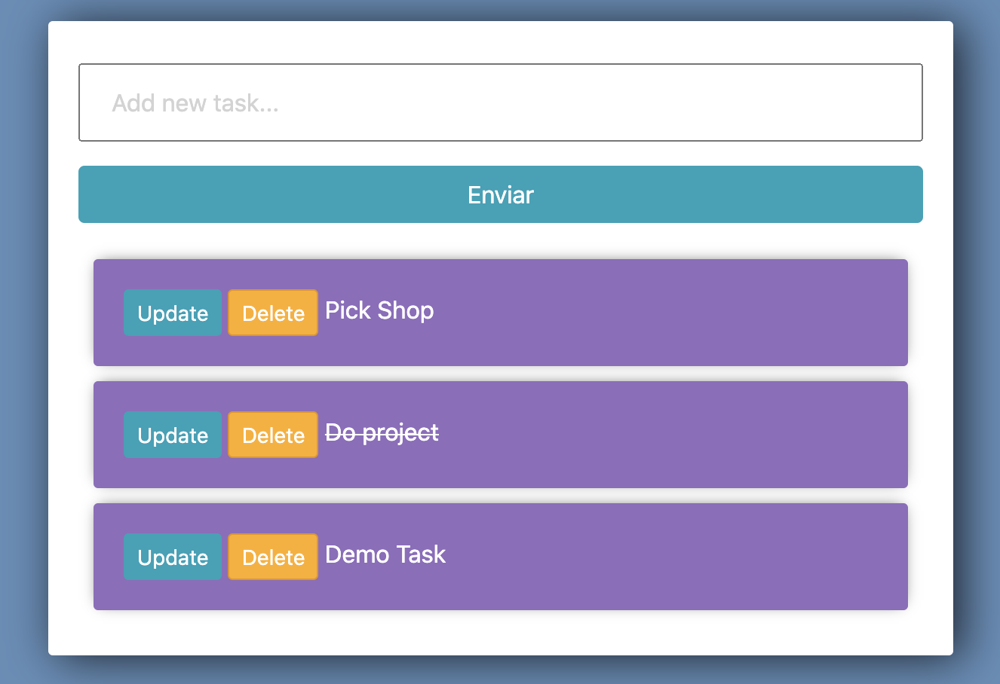

<div align="center">
  <h1>ToDo Project in Django 3</h1>
</div>

<div align="center"> 
  
</div>

# Content
- [Install Project](#Install-Project)
    - [Clone project in your machine](#Clone-project-in-your-machine)
    - [Create virtual enviroment](#Create-virtual-enviroment)
- [Start project](#Start-project)
    - [Start server](#Start-server)
    - [App](#App)


# Install Project

## Clone project in your machine

In your console go to the path where you want to clone the project and execute the command.

```zsh
git clone https://github.com/karlbehrensg/todo-django.git
```

## Create virtual enviroment
To made this step it's necesary you get install a __Python 3.6__ version or higher.

Go in to the project and create a enviroment, after that activate the enviroment and install all package required in _requirements.txt_.

```zsh
cd todo.django
python3 -m venv venv
source venv/bin/activate
pip install -r requirements.txt
```

# Start project

## Start server

With the enviroment activate you need execute this command.

```zsh
python manage.py runserver
```

## App

In a browser go to [http://127.0.0.1:8000/](http://127.0.0.1:8000/) to see the ToDo app.

<div align="center"> 
  
</div>